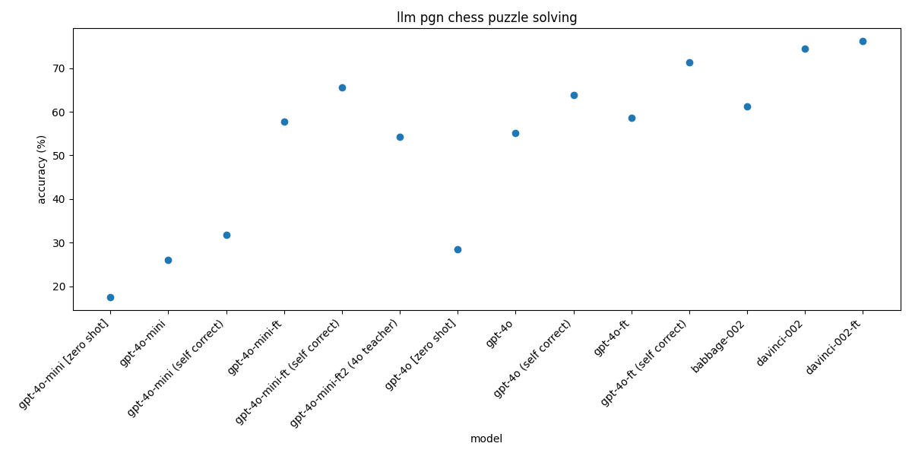

`python create_ft_data.py --max_entries 1000 --start_index 10000 `




| Model | Accuracy |
|-------|----------|
| gpt-4o-mini [zero shot] | 17.4% |
| gpt-4o-mini | 25.99% |
| gpt-4o-mini [SELF CORRECT 2 tries max] | 31.72% |
| **ft:gpt-4o-mini-2024-07-18:devpy:puzzlegod-100ex:9zKtUCDG** | 57.71% |
| **ft:gpt-4o-mini-2024-07-18:devpy:puzzlegod-it1-129ex:9zLUVZ9j** [finetuned gpt-4o as teacher] | 54.19% |
| **ft:gpt-4o-mini-2024-07-18:devpy:puzzlegod-100ex:9zKtUCDG** [SELF CORRECT 2 tries max] | 65.64% |
| gpt-4o [zero shot] | 28.44 |
| gpt-4o | 55.07% |
| gpt-4o [SELF CORRECT 2 tries max] | 63.88% |
| **ft:gpt-4o-2024-08-06:devpy:puzzlegod-100ex:9zKwkawo** | 58.59% |
| **ft:gpt-4o-2024-08-06:devpy:puzzlegod-100ex:9zKwkawo** [SELF CORRECT 2 tries max] | 71.37% |
|  |  |
| babbage-002 | 61.23% |
| davinci-002 | 74.45% |
| ft:davinci-002:devpy:davinci-chess-pgn:9rGcgkI9 | 76.21% |


top 5 from compiling:

```
Program 1 | Score: 34.68
[('generate_move', Retry(StringSignature(pgn -> rationale, move
    instructions='Given the previous moves in a chess game presented in Portable Game Notation (PGN) format, your task is to analyze the current board position, anticipate the best move considering both tactical and strategic elements, and return the correct next move in Standard Algebraic Notation (SAN) format. Make sure to provide detailed reasoning for your choice, explaining the rationale behind considering piece positions, potential threats, and opportunities for advantageous play.'
    pgn = Field(annotation=str required=True json_schema_extra={'desc': 'The chess position', '__dspy_field_type': 'input', 'prefix': 'Pgn:'})
    rationale = Field(annotation=str required=True json_schema_extra={'prefix': "Reasoning: Let's think step by step in order to", 'desc': '${produce the move}. We ...', '__dspy_field_type': 'output'})
    move = Field(annotation=str required=True json_schema_extra={'desc': 'The correct next move in SAN format', '__dspy_field_type': 'output', 'prefix': 'Move:'})
)))]
Prompt 1: Given the previous moves in a chess game presented in Portable Game Notation (PGN) format, your task is to analyze the current board position, anticipate the best move considering both tactical and strategic elements, and return the correct next move in Standard Algebraic Notation (SAN) format. Make sure to provide detailed reasoning for your choice, explaining the rationale behind considering piece positions, potential threats, and opportunities for advantageous play.

Program 2 | Score: 34.68
[('generate_move', Retry(StringSignature(pgn -> rationale, move
    instructions='Given a sequence of moves in a chess game encoded in Portable Game Notation (PGN) format, determine the next best move for the current player using Standard Algebraic Notation (SAN). Begin by analyzing the given position, considering both tactical and strategic elements. Generate a rationale that articulates your step-by-step thought process for selecting the optimal move. Your rationale should address key factors such as piece activity, king safety, material balance, and potential threats. Finally, provide the next move in SAN format and validate its legality within the context of the game. If the move is invalid, offer an explanation and propose an alternative move.'
    pgn = Field(annotation=str required=True json_schema_extra={'desc': 'The chess position', '__dspy_field_type': 'input', 'prefix': 'Pgn:'})
    rationale = Field(annotation=str required=True json_schema_extra={'prefix': "Reasoning: Let's think step by step in order to", 'desc': '${produce the move}. We ...', '__dspy_field_type': 'output'})
    move = Field(annotation=str required=True json_schema_extra={'desc': 'The correct next move in SAN format', '__dspy_field_type': 'output', 'prefix': 'Move:'})
)))]
Prompt 1: Given a sequence of moves in a chess game encoded in Portable Game Notation (PGN) format, determine the next best move for the current player using Standard Algebraic Notation (SAN). Begin by analyzing the given position, considering both tactical and strategic elements. Generate a rationale that articulates your step-by-step thought process for selecting the optimal move. Your rationale should address key factors such as piece activity, king safety, material balance, and potential threats. Finally, provide the next move in SAN format and validate its legality within the context of the game. If the move is invalid, offer an explanation and propose an alternative move.

Program 3 | Score: 34.1
[('generate_move', Retry(StringSignature(pgn -> rationale, move
    instructions='Given a series of chess moves in Portable Game Notation (PGN) format, your task is to determine and return the optimal next move in Standard Algebraic Notation (SAN) format. Ensure you carefully analyze the current board position, considering both offensive and defensive strategies. Provide a detailed reasoning process for your chosen move, addressing potential threats and opportunities. Your response should include: 1) A step-by-step explanation of your thought process and 2) The final move in SAN format. Aim for accuracy and clarity to facilitate understanding and learning.'
    pgn = Field(annotation=str required=True json_schema_extra={'desc': 'The chess position', '__dspy_field_type': 'input', 'prefix': 'Pgn:'})
    rationale = Field(annotation=str required=True json_schema_extra={'prefix': "Reasoning: Let's think step by step in order to", 'desc': '${produce the move}. We ...', '__dspy_field_type': 'output'})
    move = Field(annotation=str required=True json_schema_extra={'desc': 'The correct next move in SAN format', '__dspy_field_type': 'output', 'prefix': 'Move:'})
)))]
Prompt 1: Given a series of chess moves in Portable Game Notation (PGN) format, your task is to determine and return the optimal next move in Standard Algebraic Notation (SAN) format. Ensure you carefully analyze the current board position, considering both offensive and defensive strategies. Provide a detailed reasoning process for your chosen move, addressing potential threats and opportunities. Your response should include: 1) A step-by-step explanation of your thought process and 2) The final move in SAN format. Aim for accuracy and clarity to facilitate understanding and learning.

Program 4 | Score: 27.46
[('generate_move', Retry(StringSignature(pgn -> rationale, move
    instructions="Given a series of chess moves in Portable Game Notation (PGN) format, your task is to critically analyze the position, step-by-step, to determine and return the optimal move in Standard Algebraic Notation (SAN) format. Your reasoning should consider the current position, potential threats, tactical opportunities, and strategic goals, ensuring that the move chosen maximizes the player's advantage or mitigates any immediate threats. Provide a detailed explanation of your thought process that highlights why the chosen move is the best option in the given scenario."
    pgn = Field(annotation=str required=True json_schema_extra={'desc': 'The chess position', '__dspy_field_type': 'input', 'prefix': 'Pgn:'})
    rationale = Field(annotation=str required=True json_schema_extra={'prefix': "Reasoning: Let's think step by step in order to", 'desc': '${produce the move}. We ...', '__dspy_field_type': 'output'})
    move = Field(annotation=str required=True json_schema_extra={'desc': 'The correct next move in SAN format', '__dspy_field_type': 'output', 'prefix': 'Move:'})
)))]
Prompt 1: Given a series of chess moves in Portable Game Notation (PGN) format, your task is to critically analyze the position, step-by-step, to determine and return the optimal move in Standard Algebraic Notation (SAN) format. Your reasoning should consider the current position, potential threats, tactical opportunities, and strategic goals, ensuring that the move chosen maximizes the player's advantage or mitigates any immediate threats. Provide a detailed explanation of your thought process that highlights why the chosen move is the best option in the given scenario.

Program 5 | Score: 20.81
[('generate_move', Retry(StringSignature(pgn -> rationale, move
    instructions='Given a series of chess moves in Portable Game Notation (PGN) format, analyze the current position to determine and return the next best move in Standard Algebraic Notation (SAN) format. Your response should include a step-by-step rationale, considering factors such as piece activity, positional advantages, tactical opportunities, and any threats. Ensure that the suggested move is legal and optimizes the position for the playing side, taking into account both immediate and long-term strategic goals. If possible, highlight key lines or variations that justify the choice of move.'
    pgn = Field(annotation=str required=True json_schema_extra={'desc': 'The chess position', '__dspy_field_type': 'input', 'prefix': 'Pgn:'})
    rationale = Field(annotation=str required=True json_schema_extra={'prefix': "Reasoning: Let's think step by step in order to", 'desc': '${produce the move}. We ...', '__dspy_field_type': 'output'})
    move = Field(annotation=str required=True json_schema_extra={'desc': 'The correct next move in SAN format', '__dspy_field_type': 'output', 'prefix': 'Move:'})
)))]
Prompt 1: Given a series of chess moves in Portable Game Notation (PGN) format, analyze the current position to determine and return the next best move in Standard Algebraic Notation (SAN) format. Your response should include a step-by-step rationale, considering factors such as piece activity, positional advantages, tactical opportunities, and any threats. Ensure that the suggested move is legal and optimizes the position for the playing side, taking into account both immediate and long-term strategic goals. If possible, highlight key lines or variations that justify the choice of move.
```